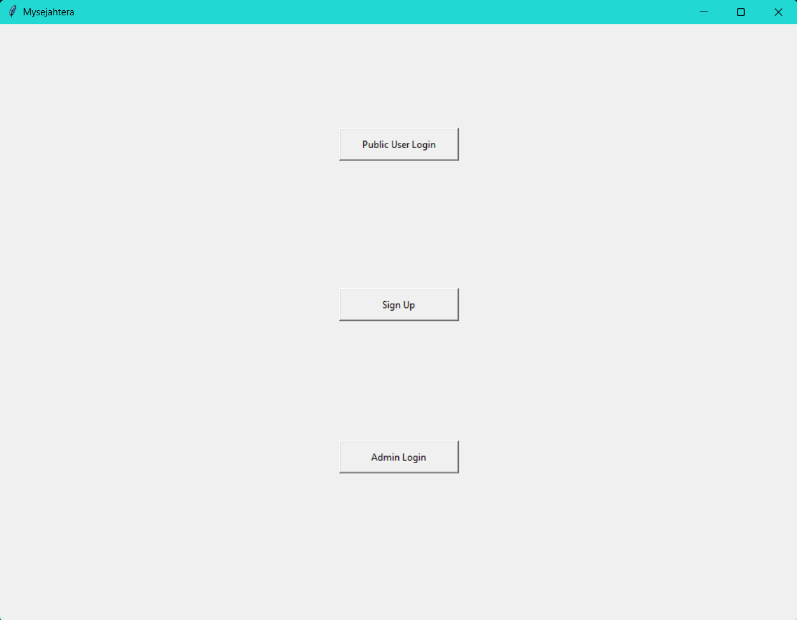
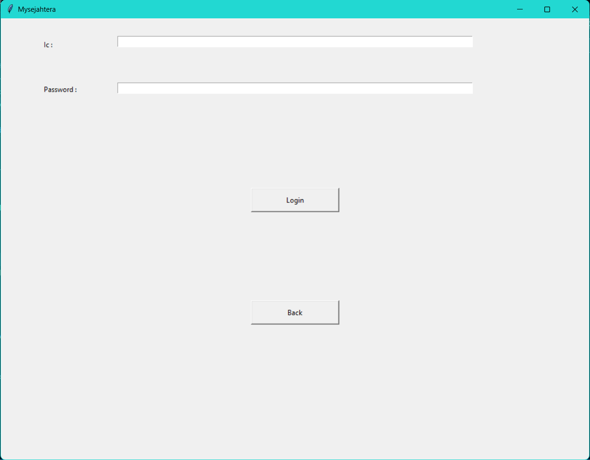
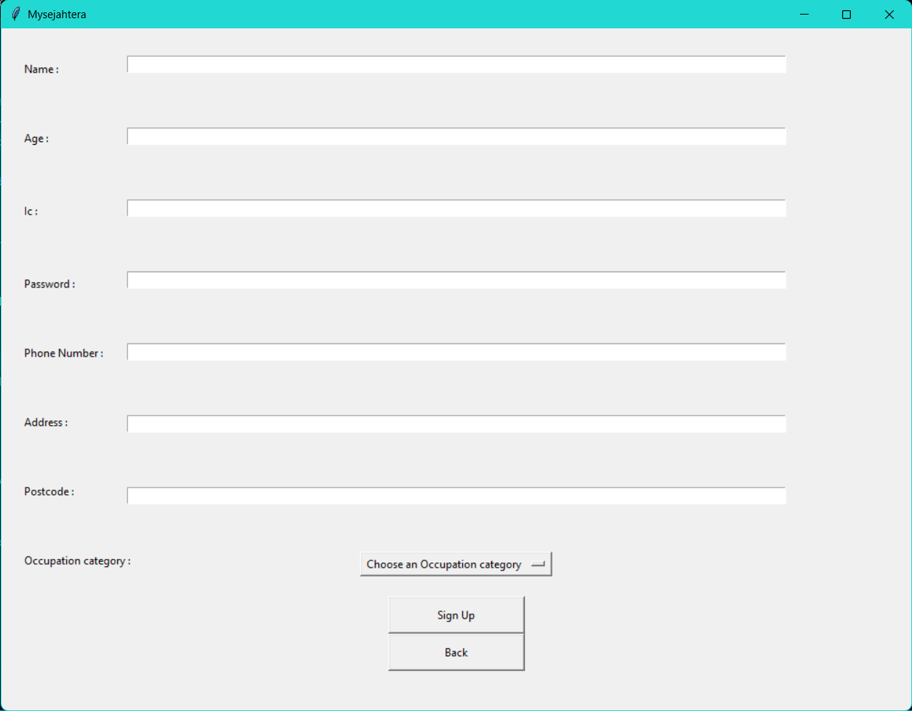
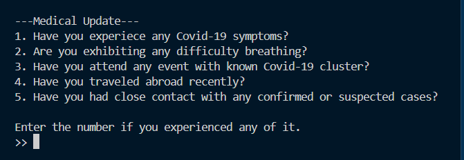
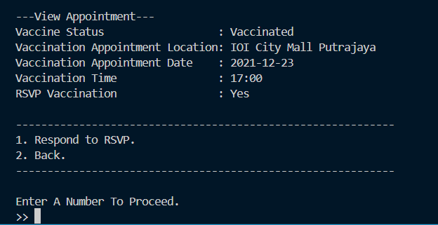
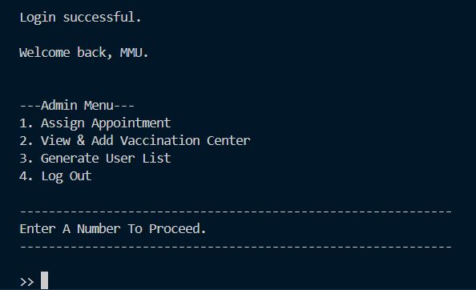
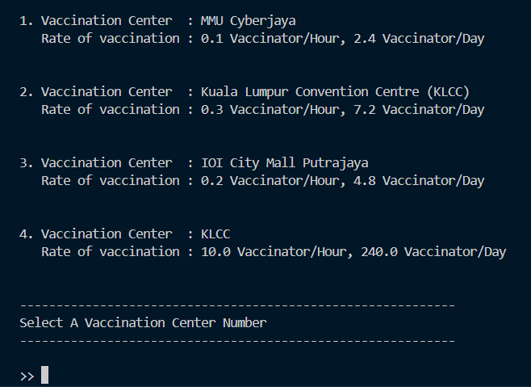
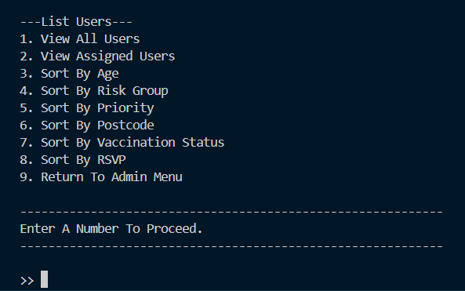

# MySejahtera (Academic Simulation)

A Python (tkinter + console) academic project simulating selected features of Malaysia's MySejahtera application: user registration, risk assessment, vaccination appointment assignment, and administrative management. Built for PSP0101 Problem Solving and Program Design (Foundation, Trimester 1 2021/22).

---

## 🌐 Overview
This project provides a hybrid GUI + console interface:
- GUI (tkinter) entry for start, login, sign up, and admin access.
- Console-driven menus for deeper user and admin operations (updating info, assigning vaccination appointments, listing/sorting users).

It focuses on fundamental programming constructs: classes, file I/O, JSON persistence, branching logic, loops, state mutation, and basic data sorting.

---

## 👥 Contributors
- Wong Ju Wei – User module, backend data extraction, integration & flowcharts
- Foong Wei Pin – GUI (tkinter front-end frames)
- Shaktish Pillai – Admin module (appointments, listings, vaccination centers)
- Shinly Eu – Login & Sign Up pages, GUI flowcharts

---

## 📁 Repository Structure
```
MySejahtera/
├── Main.py                     # Entry point (GUI + console logic)
├── Info.json                   # Persistent user data store (list of user objects)
├── VaccCenter.txt              # Vaccination center list (location, rate/hour)
├── AdministratorPassword.txt   # Admin credentials (name, password per line)
├── GROUP_INFO.txt              # Group member information
├── Group_10 Flowchart.drawio   # Architecture / flow diagrams (Draw.io)
├── Group_10 PDF.pdf            # Project report
├── img/                        # Screenshots (GUI, user flows, admin functions)
│   ├── login.png
│   ├── signin.png
│   ├── main.png
│   ├── user-page.png
│   ├── medical-update.png
│   ├── view-info.png
│   ├── view-appointment.png
│   ├── admin-page.png
│   ├── assign-appointment.png
│   └── generate-list.png
└── README.md                   # Project overview
```

---

## 🖼️ Screenshots

<details open>
<summary><strong>User Flow</strong></summary>

**Main Page**  


**Login Page**  


**Sign Up Page**  


**User Console Menu**  


**Medical Risk Update Flow**  


**View & Update Information**  


**View Appointment & RSVP**  


</details>

<details open>
<summary><strong>Admin Flow</strong></summary>

**Admin Login**  


**Assign Appointment**  


**Generate / Sort User Lists**  


</details>

---
## ✨ Features
**User-Oriented**
- Registration (Sign Up) with validation (non-empty checks)
- Login by IC & password
- Update personal information (name, age, address, postcode, phone, occupation, category, status, password)
- Medical risk group assessment questionnaire (assign Low / High Risk)
- View vaccination appointment details & RSVP (Accept / Decline)

**Admin-Oriented**
- Secure admin login (flat-file credential match)
- Assign vaccination centers, dates & times to users
- Add new vaccination centers dynamically
- Generate user lists & sort by: age, risk group, priority, postcode, vaccination status, RSVP state, assignment status

**Data & Processing**
- Persistent JSON store for user profiles
- Class-based model (`Process`) encapsulating user attributes
- Data access layer (`UserData`) for CRUD-like operations
- Text file–driven center management with computed hourly/day rates

**Interaction Modes**
- Tkinter frames: `SampleApp`, `StartPage`, `Login`, `SignUp`, `Admin`
- Console menus: User & Admin transactional flows (input-driven)

---

## 🧠 Key Concepts Demonstrated
- Object-Oriented Programming (classes, instances)
- State persistence via JSON serialization (`encode_user`, `json.dump`, `json.load`)
- File I/O (read/write/append on `.txt` & `.json`)
- Input validation and control flow (flag-based loops)
- Procedural task segmentation (functions for sorting, assignment, RSVP handling)
- Basic sorting with lambda keys and structured formatted output

---

## 🚀 Getting Started
### Prerequisites
- Python 3.8+ (tkinter typically bundled on Windows/macOS; on some Linux distros install via package manager)

### Run Locally
```powershell
# Clone repository
git clone https://github.com/juwei-w/MySejahtera.git
cd MySejahtera

# Launch application
python Main.py
```

### Files Required At Runtime
- `Info.json` must exist and contain a JSON array (even if empty: `[]`).
- `AdministratorPassword.txt` lines follow: `AdminName, Password`.
- `VaccCenter.txt` lines follow: `CenterName, RatePerHour`.

---

## 🗂 Data Model
`Process` class attributes (per user):
- Identification: `Name`, `Age`, `Ic`, `Password`
- Contact: `Address`, `PostCode`, `PhoneNum`
- Occupational: `Occupation`, `Category`, `Priority`
- Health: `Status` (Normal/Quarantine/Covid), `MedHistory` (Low/High Risk)
- Vaccination: `VaccStatus` (Assigned/Vaccinated/-), `VaccCenter`, `VaccDate`, `VaccTime`, `Rsvp`

---

## 📊 Sample Operations
- Assign Appointment: Admin chooses center (rate logic), sets date/time → updates user record
- RSVP Flow: User accepts → retains assignment; declines → resets vaccination fields
- Risk Assessment: Questionnaire answers length > threshold → mark High Risk
- Sorting: Lambdas applied to JSON dictionaries for dynamic ordering (Age, Priority, etc.)

---

## 📦 Dependencies
- Standard Library: `tkinter`, `json`
(No external third-party packages required.)

---

## 🔗 Resources
- Repository: https://github.com/juwei-w/MySejahtera
- Issues: https://github.com/juwei-w/MySejahtera/issues

---

*Problem Solving and Program Design • Foundation • Nov 2021 - March 2022*
